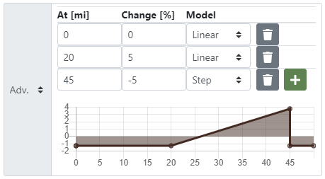

This guide will step you through creating and modifying pace Plans.

#### Getting Started
Make sure you're viewing the Course for which you intend to make a Plan.\
Log in first if you want to save this Plan for later viewing/modifying.

##### Create a Plan
If not already there, switch to the **Planning** view using the blue selection
button at the top of the page. If you don't yet have any plans, the **New Plan**
window will open automatically; otherwise select **New Plan** under the
**Actions** menu.

#### New/Modify Plan Menu

##### Name
Type in a name (required) for the Plan (you can create multiple Plans). For
example you might have an "A Goal" and "B Goal" Plan.

##### Pacing Method
Select the method for calculating pacing. Options are:
- **Elapsed time** computes splits to complete the event at the specified
  total/elapsed time. For example, a 24-hour finish.
- **Average pace** computes splits to make an average overall pace for the race.
  For example, an average of a 10:00 minute mile.
- **Normalized pace** computes splits for an average pace normalized for all
  of the factors implemented (grade, altitude, heat, terrain, darkness). For
  example, if you can run an 8:30 pace for 5 hours under flat/smooth/perfect
  conditions, see what a normalized pace of 8:30 does for your mouintain 50k
  time.

After selecting the method, enter the target value in the *Elapsed time*,
*Average pace*, or *Normalized pace* field as appropriate.

##### Aid Station Delay
Enter the typical dwell time you plan to spend at each Aid Station. This time
also applies to Waypoints designated as "Water Sources".\
Other Waypoint types such as "Junctions" or "Landmarks" do not include the
typical delay.
Unique delays for specific waypoints may be set in the Plan tab
by clicking "Edit" at the top of the page, for
example, if you are planning a short catnap somewhere or more involved
crewing/resupply in certain locations.

##### Start Date/Time/Timezone
Date and time fields are optional but recommended. By entering the start time,
Waypoint arrivals can be shown in time of day instead of just as elapsed time.
Additionally they add value to the pacing
algorithm. Date and time are required for the heat model and the
twilight/darkness model to work since they utilize sunrise and sunset
times.
An option to choose between **Course start** vs **custom start** times will
appear when creating a Plan for a Course or Race where a time has already been
specified. By selecting the *custom start* option you may specify a different
date/time.

##### Pace Drift
Enable and apply a linear change in speed throughout race. This is pacing
strategy, going out faster expecting to slow throughout, or starting
conservatively and negative splitting. Or maybe a "smell the barn" kick at the
end.

###### Basic (Linear) Drift
A value of 10% would mean you begin the
race 10% faster than you finish. Negative value for negative split.\

###### Advanced Pace Drift
By enabling the "advanced" model, you can add incremental changes through your
race. For the example 50-mile race below, holding the pace steady for the first
20 miles, then fatiguing 5% over the next 25 miles, then a finishing kick for
the last 5 miles:\

##### Heat Factor
Enable and apply the heat model to your pacing plan.\
The Baseline factor is always present even at night; a value of 10% would mean
your normalized pace is 10% faster due to heat throughout the event.\
The Maximum factor activates 1/2 hour after local sunrise and returns to
Baseline 1 hour after sunset, peaking at the maximum value specified.\

##### Notes
Optionally, add notes about this Plan for later reference.

#### Finding a saved Plan
You can later find any Plan you have created and saved in ultraPacer. When
you create a Plan for a Course, the Course is added to the *My Courses* page.
If you go to that Course, all the Plans you have created for the Course are
listed in the dropdown menu at the top.

#### Modifying a Plan
You can later modify or delete any of the settings above for Plans you own by
selecting the plan in the Course page, then clicking the pencil "edit" icon.
