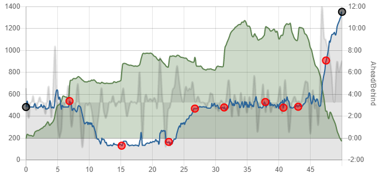

This guide will step you through comparing your actual race performance to
an ultraPacer plan.

#### Getting Started
1. You will need to have downloaded the .gpx file for your activity. This can be
  done from any fitness tracking platform (Strava, Garmin, etc).
2. Make sure you're viewing the Course and have selected the plan you would like
  to compare.

#### Post-Race View
If the date of your race has past, you will see a selection menu at the top of
the page that includes "Post-Race" view. Otherwise you can get to the comparison
feature under the Actions menu.

#### Compare to Activity
Click Browse to select your .gpx file, then select Load to process it. The tool
will map time from your activity to the points and aid stations in the Course on
ultraPacer.

#### Viewing Results
On the profile graph, you will see your time ahead/behind your plan, with
positive values on the right axis being ahead (faster than) your plan.

The Segments and Waypoints tables will now have green columns showing your
actual activity data.
On the Segments table, there is a column for actual Elapsed Time that can be
compared to your planned Elapsed Time at each segment.
On the Waypoints tab, you will see actual Arrival and Delay times for each
waypoint.
