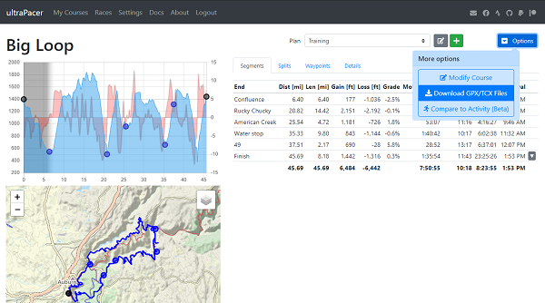
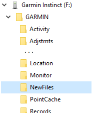
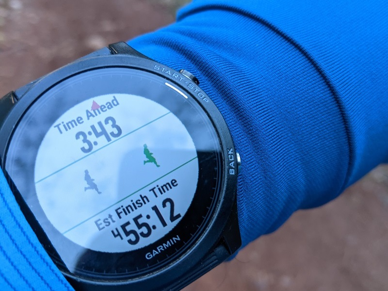
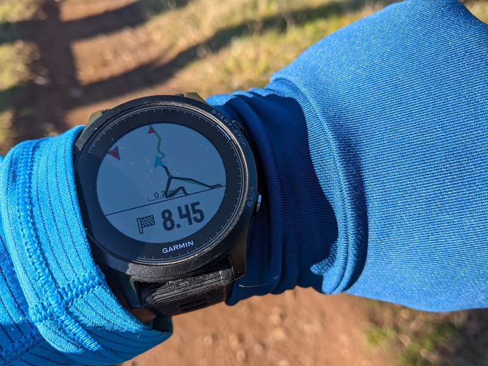

This guide will step you through using your pace Plan in real-time on your
watch. At this time, I've only done this with Garmin watches; please let me know
if you have steps for other manufacturers and we can add them to the docs.

Test this out before your race! Create a Course and a Plan in your neighborhood
if you don't live next to the race itself.

#### Garmin with Virtual Partner
1.  For the activity settings on your watch, you need to have the Virtual
    Partner data screen. Add this to your activity settings if necessary.

2.  While viewing your plan, click the download button. Download the .gpx file
    at original resolution. If you have trouble with the file size of the
    original resolution file, you can try the low resolution one.\
    

3.  Plug in your watch to your PC and copy the .gpx file into the NewFiles
    folder in your Garmin watch.\
    

4.  When you are starting your race/adventure, go to **Navigation** on your
    Garmin and select your file under **Courses**.

5.  Go! You'll see the time ahead/behind your pace plan in real time. But don't
    forget to watch the trail too!\
    \
    You will also be able to use other navigation features, such as the map
    and remaining distance.\
    

**Notes:**
- The estimated race time/ETA/ETC fields in your Garmin are based on remaining
  distance and current pace only, not the time data in the .gpx file (your pace
  plan). The ahead/behind time in the Virtual Partner screen is the only field
  that actually factors in the time data (pace plan) from the .gpx file.
- I have tested this out with the Garmin 935 and Garmin Instinct, but I believe
  it should work similarly for any Garmin with the Virtual Partner feature.

#### Other Manufacturers
Does this work with Coros, Suunto, Polar, etc? Try it out, let me know how to
do it and I'll add it to docs.
